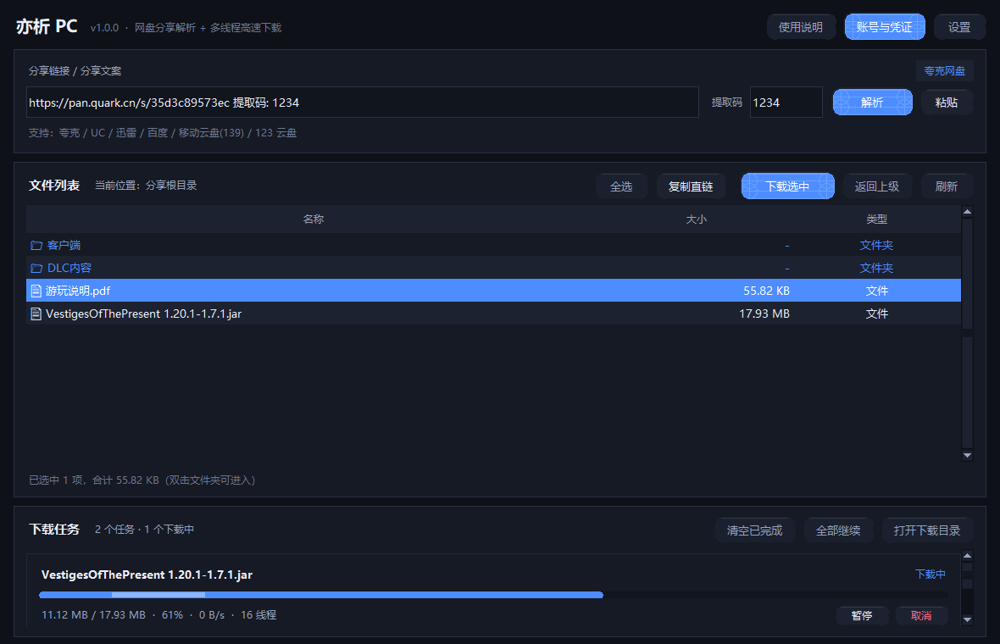
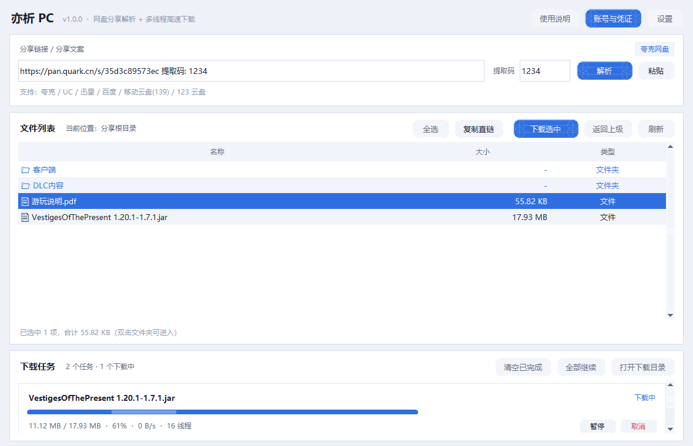

# 亦析 PC（YiXi PC）

网盘分享链接解析 + 多线程高速下载的 **Windows 桌面工具**。
粘贴分享链接、在程序内登录网盘账号，即可浏览分享内容并多线程高速下载文件。

> （AGPL-3.0）。

> 作者：**亦亦** · 完全免费开源，仅在本仓库发布。如果你是付费购买得到的，那一定是被坑了。



## 下载

* **可执行文件**：到 [Releases](https://github.com/yiyi0904/by-yiyi-love/releases) 页面下载 `亦析PC.exe`
* **源码**：直接 clone 本仓库，按下方说明自行构建

> Windows 10 / 11，免安装，双击即用。

## 支持的网盘

| 平台 | 登录方式 | 取链方式 |
| --- | --- | --- |
| 夸克网盘 | 内置网页登录（Cookie） | 直接取链，不占网盘空间 |
| UC 网盘 | 内置网页登录（Cookie） | 直接取链 |
| 迅雷网盘 | 内置网页登录（官方账号授权）/ 账号密码+短信 | 临时转存后取链，自动清理 |
| 百度网盘 | 内置网页登录（Cookie） | 转存后取 locatedownload 高速直链，自动清理 |
| 移动云盘 139 | 内置网页登录（Cookie） | 分享直链（AES 加密接口） |
| 123 云盘 | 内置网页登录（authorToken） | 签名直链 |

## 功能特性

- **一键解析**：分享链接 / 整段分享文案自动识别，提取码自动提取
- **高速分片下载**：多线程并发 + 断点续传，支持暂停 / 继续 / 重试；服务端不支持分片时自动回退单线程
- **内置网页登录**：程序内打开官方登录页（系统自带 WebView2），凭证自动保存与续期
- **下载管理**：进度、速度、剩余时间、线程数实时显示，支持全局限速与 HTTP 代理
- **界面风格**：蓝色风格 / 白色风格一键切换
- **取链不残留**：夸克直接取链；其他平台的临时转存目录下载后自动清理



## 运行

下载 Releases 里的 `亦析PC.exe`，双击运行即可（Windows 10 / 11，无需安装）。
首次启动约 3–5 秒（单文件自解压），之后更快。

## 从源码构建

```bash
pip install requests cryptography qrcode pillow pywebview pyinstaller
python make_icon.py head      # 由 assets/source_icon.jpg 生成 app.ico / icon.png
python build.py               # 打包到 dist/亦析PC.exe
```

源码结构：

```
app.py                 程序入口（含 --selftest / --spawntest / --weblogin 自检与兜底入口）
yunx/
  models.py            数据模型
  link_parser.py       分享链接解析
  net.py               HTTP 封装（代理 / Cookie 维护）
  config.py            配置持久化
  downloader.py        多线程分片下载引擎（断点续传 / 回退单流）
  limiter.py           全局限速
  weblogin.py          内置网页登录（WebView2，同进程会话）
  device_page.py       扫码授权页渲染
  platforms/           各网盘实现：quark / uc / baidu / pan123 / c139 / xunlei
  ui/                  界面层（主题、动画控件、对话框）
```

## 免责声明

本工具仅用于个人学习与合法的文件传输，解析与下载能力依赖各网盘官方接口。
请勿用于传播盗版、侵权或违法内容，使用产生的后果由使用者自行承担。


## 开源协议

本项目基于 **GNU AGPL-3.0** 协议开源（与上游 YunX 一致）。
接口逻辑版权归原项目 [CYQawa/YunX](https://github.com/CYQawa/YunX) 所有。
